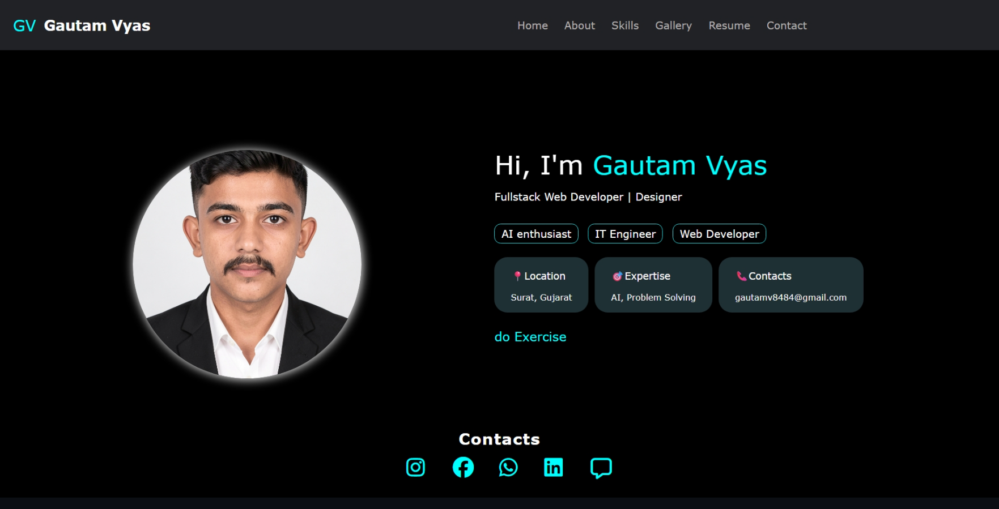
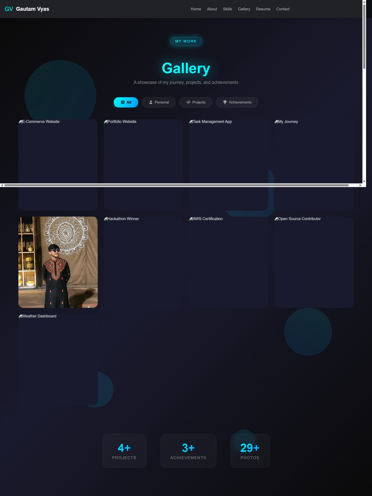

# 🚀 Portfolio Website

Welcome to my personal portfolio! This project showcases my skills, projects, and experience as a Full Stack Developer.

---

## 🌐 Live Demo
👉 https://your-portfolio.vercel.app

---

## 👨‍💻 About Me
I am a Full Stack Developer specializing in the MERN stack (MongoDB, Express.js, React, Node.js).  
I build scalable, user-friendly web applications and enjoy solving real-world problems through clean and efficient code.

---

## 🛠️ Tech Stack
- Frontend: React.js, HTML5, CSS3, JavaScript  
- Backend: Node.js, Express.js  
- Database: MongoDB  
- Tools: Git, GitHub, Vercel  

---

## 📌 Features
- Responsive design (mobile-friendly 📱)  
- Modern UI/UX  
- Project showcase with live links  
- Contact section  

---

## 📂 Folder Structure
src/
├── components/
├── pages/
├── styles/
└── App.jsx

---

---

## 🔗 Projects Included
- Hostel Management System  
- Digital Seva Platform  
- Other Web Applications  

---

## 📬 Contact Me
- LinkedIn: https://linkedin.com/in/gautamv1312  
- GitHub: https://github.com/gautamv8484  

---

## ⭐ Support
If you like this project, please give it a ⭐ on GitHub!
